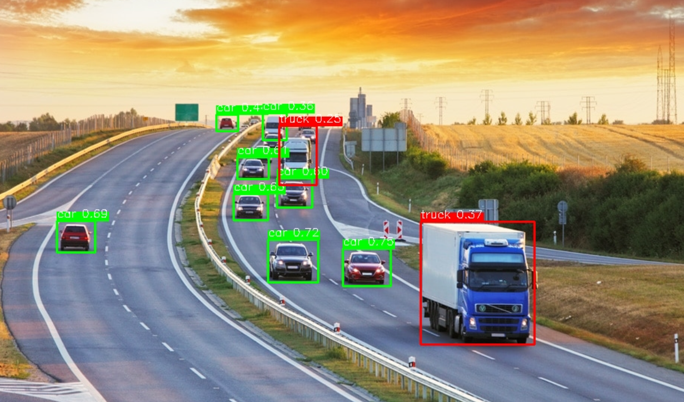
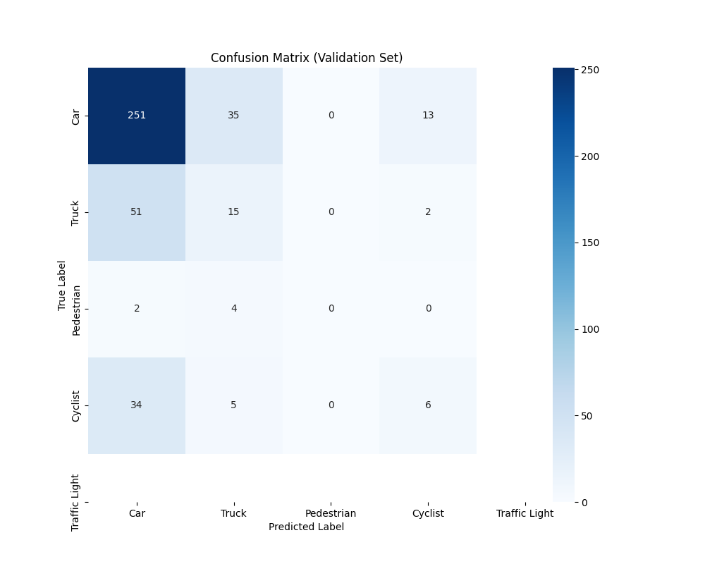

# 🚗 YOLOv8 Autonomous Driving Object Detection

This project implements a real-time object detection system for autonomous driving using **KerasCV** and **YOLOv8**. It detects cars, trucks, pedestrians, cyclists, and traffic lights from video feeds.


*(Sample output from the model showing detected vehicles)*

## 📋 Overview

* **Model:** YOLOv8 (Medium Backbone pre-trained on COCO).
* **Framework:** TensorFlow / KerasCV.
* **Input:** 1920x1080 Dashcam Videos.
* **Preprocessing:** Resizing with padding (letterboxing) to maintain aspect ratio.

## 📥 Pre-trained Model

Since the trained model file exceeds GitHub's size limit, it is hosted on Google Drive. You can download it to skip the training process and test the inference immediately.

👉 **[Download YOLOv8 Final Model (.keras)](https://drive.google.com/file/d/1JZ0OmNuOIK8l4xxo5KoThcNpykMzsCtq/view?usp=sharing)**

## 📂 Dataset

The model is trained on the **Self Driving Cars** dataset sourced from Kaggle.
* **Source:** [Kaggle - Self Driving Cars Dataset](https://www.kaggle.com/datasets/alincijov/self-driving-cars)
* **Classes:** `Car`, `Truck`, `Pedestrian`, `Bicyclist`, `Traffic Light`.
* **Note:** The notebook is configured to automatically download this dataset using the Kaggle API.

## 📊 Performance & Analysis

### ⚠️ Project Status: Prototype / Proof of Concept
This project is developed as a **prototype** to demonstrate the capabilities of YOLOv8 on autonomous driving tasks. Due to computational constraints, the model was trained for **10 epochs** on a subset of the dataset.

### ✅ Strengths:
* **Near Detection:** The model performs excellently on identifying vehicles and pedestrians within a close range (0-30 meters).
* **Real-time Inference:** The inference pipeline is optimized for speed, suitable for real-time video processing.

### 🚧 Current Limitations & Areas for Improvement:
* **Distant Objects:** Accuracy drops for small objects appearing far in the horizon.
* **Class Imbalance:** As seen in the confusion matrix below, the model has a bias towards the "Car" class due to dataset imbalance.
* **Environmental Conditions:** The model is currently optimized for daylight conditions. Further training is required for night driving or rainy weather performance.



### Key Observations:
1.  **Car Bias:** The model is highly accurate at detecting cars (Majority Class) but tends to misclassify Trucks and Pedestrians as "Cars". This is due to class imbalance and limited training time.
2.  **Robustness:** Despite the short training, the pipeline successfully localizes objects and handles video inference smoothly.

## 🚀 How to Run

1.  Clone the repository:
    ```bash
    git clone [https://github.com/KULLANICI_ADIN/YOLOv8-Autonomous-Driving.git](https://github.com/KULLANICI_ADIN/YOLOv8-Autonomous-Driving.git)
    ```
2.  Install dependencies:
    ```bash
    pip install -r requirements.txt
    ```
3.  **Option A (Fast Test):** Download the `.keras` model from the link above, upload it to your working directory, and run only the *Inference* cells in the notebook.
4.  **Option B (Full Training):** Open the `.ipynb` notebook in Google Colab and run all cells to train the model from scratch.

## 🛠️ Tech Stack
* Python 3.10+
* TensorFlow 2.15
* KerasCV
* OpenCV
