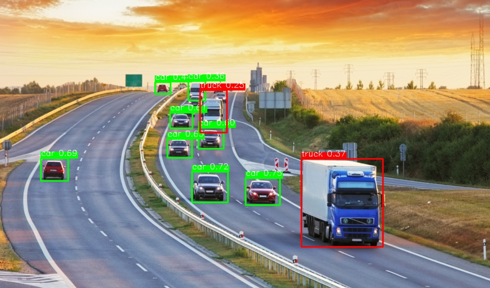
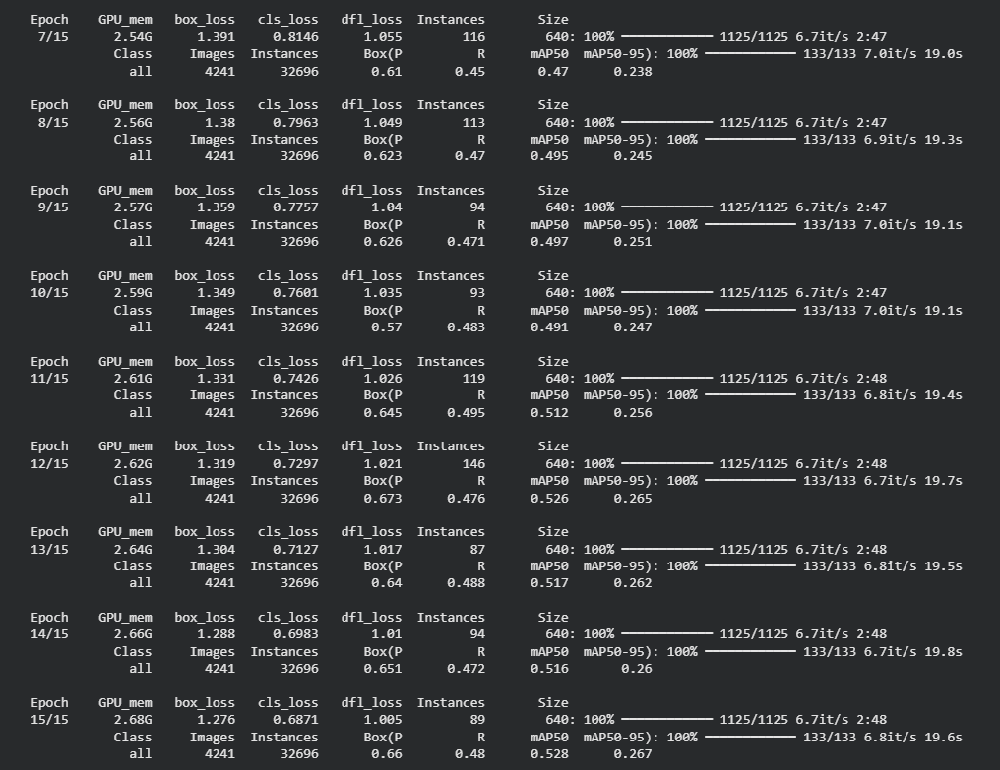
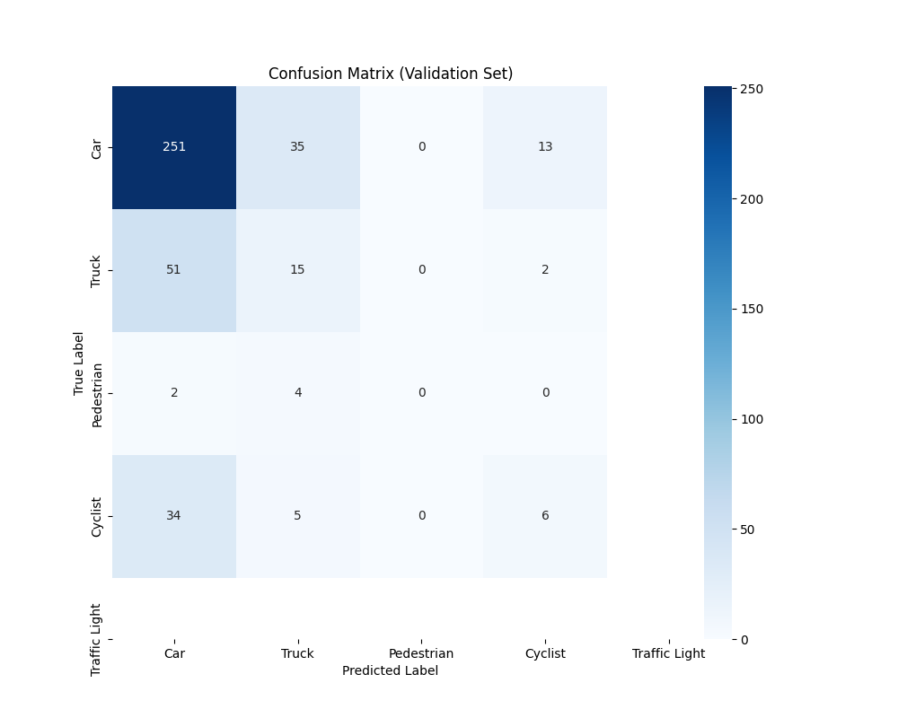

# 🚗 YOLOv8 Autonomous Driving Object Detection System


---


> *(Video File Inference ~15 FPS — High-resolution traffic video, rendering bottleneck)*


> *(Live Camera Inference 30+ FPS — Real-time GPU throughput under optimal lighting)*

> FPS varies depending on input source, resolution, and rendering overhead.
> Live camera tests demonstrate true low-latency GPU inference capability.

## 📋 Overview
This project is an **end-to-end object detection system** designed for autonomous driving scenarios.  
It follows a **hybrid deployment strategy**, allowing the same solution to run efficiently on both **cloud CPU environments** and **local GPU-powered edge devices**.

The system supports:
- **Static image inference** via cloud-based microservices
- **Real-time video & camera inference** via local GPU acceleration

---

## 🏗 System Architecture

The project is built around a **Hybrid Architecture** with two complementary inference pipelines:

- **Cloud Mode (CPU / TFLite)**  
  Lightweight inference optimized for low-cost servers using **FastAPI + TFLite**, containerized with Docker.

- **Local Mode (GPU / PyTorch)**  
  High-performance real-time inference using **YOLOv8 + CUDA**, designed for live camera and video streams.

This separation enables scalability from free-tier cloud deployments to high-performance edge systems without code duplication.

---

## ⚡ Key Features
- **Dual Inference Engines**
  - **YOLOv8 (PyTorch):** Real-time GPU inference for video & camera streams
  - **TFLite (CPU):** Optimized static image inference for cloud & edge devices
- **Microservice-Based Design**
  - FastAPI backend for inference APIs
  - Streamlit frontend for visualization and interaction
- **Robust Preprocessing Pipeline**
  - Letterbox resizing
  - Accurate coordinate recovery for bounding boxes
- **Deployment Ready**
  - Dockerized cloud environment
  - Separate dependency management for CPU and GPU modes

---



## 🎮 Live Demo (Cloud – Static Image)
Try the deployed application for **image-based object detection**:  
**[👉 Open Live App](https://yolov8-autonomous-driving.onrender.com)**

> **⚠️ Note:** Render Free Tier may take ~1 minute to wake up.  
> **⚠️ Limitation:** Real-time video inference is available only in local GPU mode.

---

## 🧠 Model & Dataset

Both the PyTorch (.pt) and TFLite models were fine-tuned from pre-trained YOLOv8 weights on the same dataset. The system uses models derived from the same training pipeline and deployed in two formats:

- **Local Model:** `best.pt`  
  YOLOv8 Nano (PyTorch) – optimized for high FPS and accuracy on NVIDIA GPUs

- **Cloud Model:** `yolov8_high_acc.tflite`  
  Float32 TFLite model – optimized for CPU and edge inference

**Detected Classes:**  
Car | Truck | Pedestrian | Cyclist | Traffic Light

**Dataset:**  
Self-Driving Cars Dataset (Kaggle)  
https://www.kaggle.com/datasets/alincijov/self-driving-cars

---

## 🏗 Project Structure

```text
YOLOv8-Autonomous-Driving/
│
├── app/                         # Shared application logic
│   ├── inference.py             # TFLite inference engine
│   └── utils.py                 # Preprocessing & visualization
│
├── yolov8_live/                 # Local GPU inference module
│   ├── live_app.py              # Real-time video & camera app
│   ├── best.pt                  # Trained YOLOv8 model
│   ├── PyTorch_train_model.ipynb
│   └── requirements-gpu.txt
│
├── api.py                       # FastAPI backend
├── streamlit_app.py             # Streamlit frontend (API mode)
├── convert_model.py             # Keras → TFLite conversion
├── YOLOv8_Autonomous_Driving_Training.ipynb
├── start.sh                     # Docker entrypoint
├── yolov8_high_acc.tflite
├── Dockerfile
├── requirements.txt
└── README.md
```

---

🚀 How to Run
Option 1: Local GPU Mode (Recommended for Video)

Requires an NVIDIA GPU with CUDA support.
```
git clone https://github.com/alperenndemirbas/YOLOv8-Autonomous-Driving
cd YOLOv8-Autonomous-Driving
pip install -r yolov8_live/requirements-gpu.txt
streamlit run yolov8_live/live_app.py
```
Select Live Camera or Video File from the sidebar.

Option 2: Cloud / Docker Mode (CPU Only)
```
docker build -t yolo-autonomous-app .
docker run -p 8501:8501 yolo-autonomous-app
```
Access: http://localhost:8501

---

📉 Training Summary

- Model: YOLOv8 Nano

- Epochs: 15

- Training Environment: Google Colab (GPU)

- Result: Rapid convergence with high confidence scores for vehicle classes

The model can be further improved with stronger data augmentation and improved class balance for minority classes.



---

📊 Confusion Matrix Analysis

The Confusion Matrix indicates:

- High accuracy for Car detection

- Lower performance for Pedestrian, Cyclist, and Traffic Light

Root Cause: Class imbalance in the dataset.



---

🔧 Design Decisions

- YOLOv8 Nano: Chosen for its balance between speed and accuracy, suitable for real-time systems.

- TFLite for Cloud: Enables deployment on low-resource servers and edge devices.

- Hybrid Architecture: Separates real-time and static workloads to maximize performance and scalability.

- Streamlit + FastAPI: Rapid prototyping with clear frontend-backend separation.

---

📌 Conclusion

This project demonstrates a scalable object detection system capable of running across cloud and edge environments.
By combining GPU-accelerated real-time inference with CPU-optimized cloud deployment, it provides a flexible foundation for autonomous driving and intelligent transportation systems.